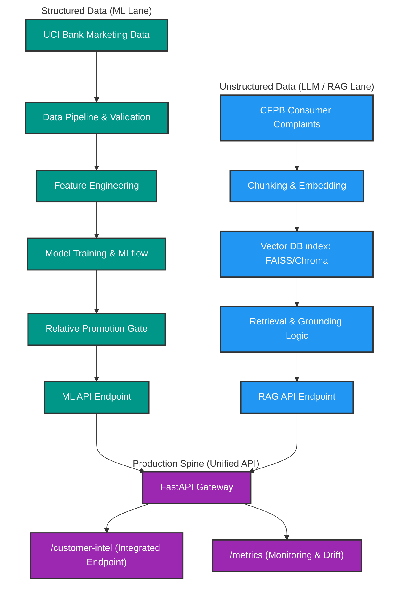

# Meridian Financial Customer Intelligence Platform

[](https://www.python.org/)
[](https://fastapi.tiangolo.com/)
[](https://groq.com/)
[](https://xgboost.readthedocs.io/)
[](https://opensource.org/licenses/MIT)


# Loom Demo Videos

### [Part 1 :- Problem Statement, Idea, Approach](https://www.loom.com/share/6ccd70556d844f6f8059473f33a9a0ce) 

### [Part 2:- Codebase, Azure and GitHub Walkthrough](https://www.loom.com/share/197bbfd4362e418ab2e661848a61ea31)


## Problem Statement

Meridian Financial needs a production-minded Customer Intelligence Platform to run smarter outreach campaigns and resolve customer complaints at scale. The system requires deploying one classical Machine Learning (ML) service and one Large Language Model (LLM) / Retrieval-Augmented Generation (RAG) service, both integrated behind a single production API spine.

The platform is divided into two primary lanes:

1. **Machine Learning Service**: Predicts campaign conversion (whether a contacted customer will subscribe to a term-deposit product) using structured customer data.
2. **LLM/RAG Service**: Answers operational and intelligence questions over free-text complaint narratives using cited evidence and validation.

---

## Datasets & Data Pipeline

For detailed documentation on the datasets, schemas, and download sources used in this platform, see [Dataset Reference](docs/dataset_reference.md).


## Architecture Diagram 


---

## ML API & Serving

The platform hosts the ML model through a serving layer built with **FastAPI**, **Pydantic (V2)**, and **Uvicorn**.

### Running the API Server

Start the API server locally:

```bash
uvicorn src.serving.serve:app --host 0.0.0.0 --port 8000 --reload
```

Alternatively, you can run it via Python:

```bash
python -m src.serving.serve
```

Once running, you can access the interactive OpenAPI docs at `http://localhost:8000/docs`.

### API Endpoints

#### 1. `GET /health`
Returns the status of the server and the version of the currently loaded model and vector index.
* **Response Example**:
  ```json
  {
    "status": "ok",
    "ml_model_version": "xgboost_v1",
    "vector_index_version": "faiss_v1"
  }
  ```

#### 2. `POST /predict`
Accepts customer features as JSON, preprocesses the payload (including generating derived features like `pdays_contacted` and `has_previous_contact`), and returns the predicted probability and decision class (conversion target).
* **Request Example**:
  ```json
  {
    "age": 30,
    "job": "blue-collar",
    "marital": "married",
    "education": "basic.9y",
    "default": "no",
    "housing": "yes",
    "loan": "no",
    "contact": "cellular",
    "month": "may",
    "day_of_week": "fri",
    "duration": 250,
    "campaign": 1,
    "pdays": 999,
    "previous": 0,
    "poutcome": "nonexistent",
    "emp.var.rate": -1.8,
    "cons.price.idx": 92.893,
    "cons.conf.idx": -46.2,
    "euribor3m": 1.313,
    "nr.employed": 5099.1
  }
  ```
* **Response Example**:
  ```json
  {
    "prediction": 0,
    "probability": 0.1245,
    "threshold_decision": ">=0.5",
    "model_version": "xgboost_v1"
  }
  ```

#### 3. `POST /batch-score`
Scores a batch of customers at once, returning aggregate conversion band counts.
* **Request Example**:
  ```json
  {
    "features": [
      {
        "age": 30,
        "job": "blue-collar",
        "marital": "married",
        "education": "basic.9y",
        "default": "no",
        "housing": "yes",
        "loan": "no",
        "contact": "cellular",
        "month": "may",
        "day_of_week": "fri",
        "duration": 250,
        "campaign": 1,
        "pdays": 999,
        "previous": 0,
        "poutcome": "nonexistent",
        "emp.var.rate": -1.8,
        "cons.price.idx": 92.893,
        "cons.conf.idx": -46.2,
        "euribor3m": 1.313,
        "nr.employed": 5099.1
      }
    ]
  }
  ```
- **Response Example**:
  ```json
  {
    "total_scored": 1,
    "conversion_counts": {
      "0": 1,
      "1": 0
    },
    "model_version": "xgboost_v1"
  }
  ```

### Promotion Gate Details

When starting the server, `src/serving/model_loader.py` checks `docs/promotion_decision.json` to decide which model version to load:

- If the promotion gate passes (`is_promoted: true`), it loads the promoted model located in `models/promoted_model.joblib`.
- If it fails or is absent, it logs a warning and falls back to loading a baseline model from the same directory or throws an error.

---

## LLM/RAG Service

The LLM/RAG service is built to answer inquiries about customer complaints using context retrieved from a FAISS vector index of CFPB complaints, powered by Groq's `llama-3.1-8b-instant` LLM.

### API Key Configuration

To use the RAG endpoint, set your Groq API key in your environment:

```bash
export GROQ_API_KEY="your-groq-api-key"
```

A default key is fallback-configured for ease of testing, but configuring your own key via the environment variable is recommended.

### Building & Initializing the RAG Index

If you need to build or rebuild the index from raw complaints data, run the indexing script:

```bash
python src/rag/index.py
```

This script:
1. Loads raw complaints from `data/raw/cfpb_complaints.csv`.
2. Generates sentence chunks of length 500 characters (with 50 overlap).
3. Encodes chunks using `all-MiniLM-L6-v2` embeddings.
4. Generates and stores the FAISS index (`src/rag/index.faiss`) and the mapping metadata (`src/rag/metadata.json`).

### RAG API Endpoint

#### 4. `POST /ask-complaints`
Accepts a user question and an optional product filter, queries the local FAISS index, retrieves the most relevant chunks, and passes them as cited evidence to the Llama-3.1 model.
* **Request Example**:
  ```json
  {
    "question": "Why did I get charged an overdraft fee when I had money?",
    "filter_product": "Bank account or service"
  }
  ```
* **Response Example**:
  ```json
  {
    "answer": "Based on the provided evidence, you were charged an overdraft fee because of a processing delay in a deposit [ID: 123456_0].",
    "cited_evidence_ids": [
      "123456_0",
      "123456_1"
    ],
    "evidence_sufficiency_note": "Note: The provided evidence was sufficient to address the question.",
    "prompt_version": "v1.0"
  }
  ```

---

## Running Tests

You can run the entire test suite using:

```bash
pytest -v
```

### macOS Threading Conflict Note
> [!WARNING]
> When running `pytest -v` sequentially, you might encounter a **Segmentation Fault** due to an OS-level conflict between macOS, Python 3.13, anyio (used by FastAPI's `TestClient`), and XGBoost's OpenMP compilation. This is an environment/runner issue; the application code runs correctly.
>
> To run tests safely without triggering the conflict, run the individual test suites separately:

- **RAG & Retrieval Tests** (validates embedding search, LLM responses, and citations):
  ```bash
  pytest tests/test_retrieval.py -v
  ```

- **Feature Engineering Tests**:
  ```bash
  pytest tests/test_features.py -v
  ```

- **Data Validation Tests**:
  ```bash
  pytest tests/test_validation.py -v
  ```

- **API Schema Tests**:
  ```bash
  pytest tests/test_schema.py -v
  ```