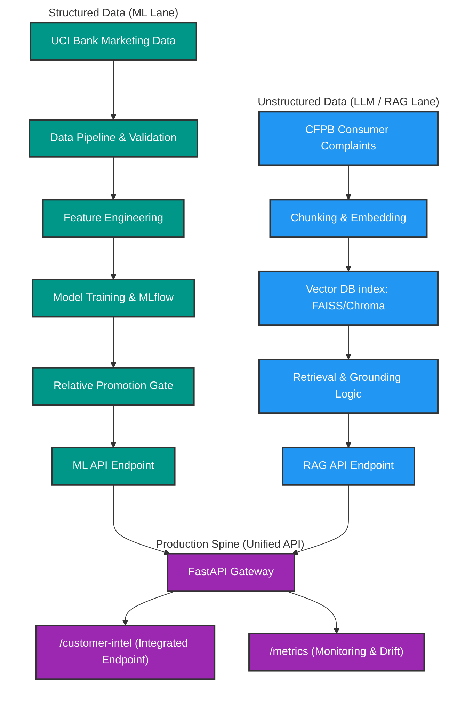

# Meridian Financial Customer Intelligence Platform

## Problem Statement

Meridian Financial needs a production-minded Customer Intelligence Platform to run smarter outreach campaigns and resolve customer complaints at scale. The system requires deploying one classical Machine Learning (ML) service and one Large Language Model (LLM) / Retrieval-Augmented Generation (RAG) service, both integrated behind a single production API spine.

The platform is divided into two primary lanes:

1. **Machine Learning Service**: Predicts campaign conversion (whether a contacted customer will subscribe to a term-deposit product) using structured customer data.
2. **LLM/RAG Service**: Answers operational and intelligence questions over free-text complaint narratives using cited evidence and validation.

---

## Datasets & Data Pipeline

For detailed documentation on the datasets, schemas, and download sources used in this platform, see [Dataset Reference](/docs/dataset_reference.md).


## Architecture Diagram 



---

## ML API & Serving

The platform hosts the ML model through a serving layer built with **FastAPI**, **Pydantic (V2)**, and **Uvicorn**.

### Running the API Server

Start the API server locally:

```bash
uvicorn src.serving.serve:app --host 0.0.0.0 --port 8000 --reload
```

Alternatively, you can run it via Python:

```bash
python -m src.serving.serve
```

Once running, you can access the interactive OpenAPI docs at `http://localhost:8000/docs`.

### API Endpoints

#### 1. `GET /health`
Returns the status of the server and the version of the currently loaded model and vector index.
* **Response Example**:
  ```json
  {
    "status": "ok",
    "ml_model_version": "xgboost_v1",
    "vector_index_version": "not_implemented_yet"
  }
  ```

#### 2. `POST /predict`
Accepts customer features as JSON, preprocesses the payload (including generating derived features like `pdays_contacted` and `has_previous_contact`), and returns the predicted probability and decision class (conversion target).
* **Request Example**:
  ```json
  {
    "age": 30,
    "job": "blue-collar",
    "marital": "married",
    "education": "basic.9y",
    "default": "no",
    "housing": "yes",
    "loan": "no",
    "contact": "cellular",
    "month": "may",
    "day_of_week": "fri",
    "duration": 250,
    "campaign": 1,
    "pdays": 999,
    "previous": 0,
    "poutcome": "nonexistent",
    "emp.var.rate": -1.8,
    "cons.price.idx": 92.893,
    "cons.conf.idx": -46.2,
    "euribor3m": 1.313,
    "nr.employed": 5099.1
  }
  ```
* **Response Example**:
  ```json
  {
    "prediction": 0,
    "probability": 0.1245,
    "threshold_decision": ">=0.5",
    "model_version": "xgboost_v1"
  }
  ```

#### 3. `POST /batch-score`
Scores a batch of customers at once, returning aggregate conversion band counts.
* **Request Example**:
  ```json
  {
    "features": [
      {
        "age": 30,
        "job": "blue-collar",
        "marital": "married",
        "education": "basic.9y",
        "default": "no",
        "housing": "yes",
        "loan": "no",
        "contact": "cellular",
        "month": "may",
        "day_of_week": "fri",
        "duration": 250,
        "campaign": 1,
        "pdays": 999,
        "previous": 0,
        "poutcome": "nonexistent",
        "emp.var.rate": -1.8,
        "cons.price.idx": 92.893,
        "cons.conf.idx": -46.2,
        "euribor3m": 1.313,
        "nr.employed": 5099.1
      }
    ]
  }
  ```
- **Response Example**:
  ```json
  {
    "total_scored": 1,
    "conversion_counts": {
      "0": 1,
      "1": 0
    },
    "model_version": "xgboost_v1"
  }
  ```

### Promotion Gate Details

When starting the server, `src/serving/model_loader.py` checks `docs/promotion_decision.json` to decide which model version to load:

- If the promotion gate passes (`is_promoted: true`), it loads `xgboost_v1`.
- If it fails or is absent, it logs a warning and falls back to `baseline_or_fallback_v1`.

### Running Tests

You can run the entire test suite (including data validation, feature engineering, and serving tests) using:

```bash
pytest -v
```

Or you can run specific sets of tests:

- **Data Validation Tests** (validates Pandera schemas on raw dataset formats):
  ```bash
  pytest tests/test_validation.py -v
  ```

- **Feature Engineering Tests** (validates derived feature logic and preprocessing):
  ```bash
  pytest tests/test_features.py -v
  ```

- **API Schema & Serving Tests** (validates request/response parsing and endpoint operations):
  ```bash
  pytest tests/test_schema.py tests/test_payload.py -v
  ```