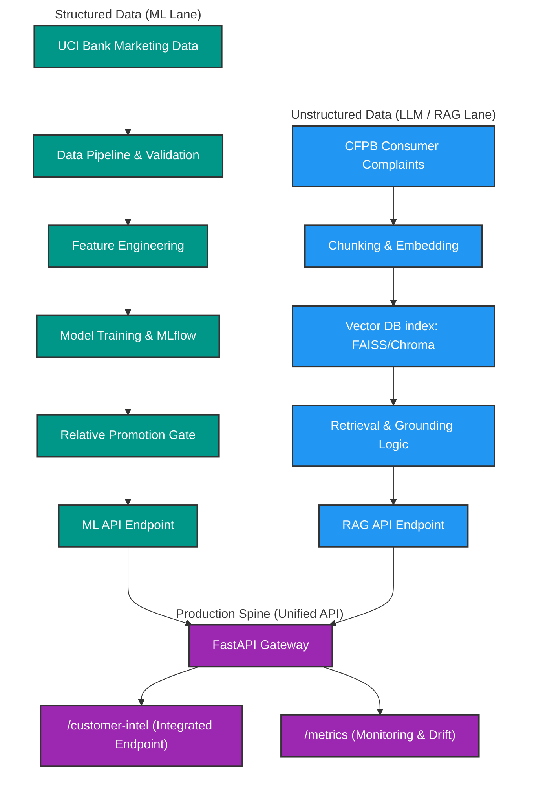

# Meridian Financial Customer Intelligence Platform

## Problem Statement

Meridian Financial needs a production-minded Customer Intelligence Platform to run smarter outreach campaigns and resolve customer complaints at scale. The system requires deploying one classical Machine Learning (ML) service and one Large Language Model (LLM) / Retrieval-Augmented Generation (RAG) service, both integrated behind a single production API spine.

The platform is divided into two primary lanes:

1. **Machine Learning Service**: Predicts campaign conversion (whether a contacted customer will subscribe to a term-deposit product) using structured customer data.
2. **LLM/RAG Service**: Answers operational and intelligence questions over free-text complaint narratives using cited evidence and validation.

---

## Datasets & Data Pipeline

For detailed documentation on the datasets, schemas, and download sources used in this platform, see [Dataset Reference](/docs/dataset_reference.md).

## Architecture Diagram 

